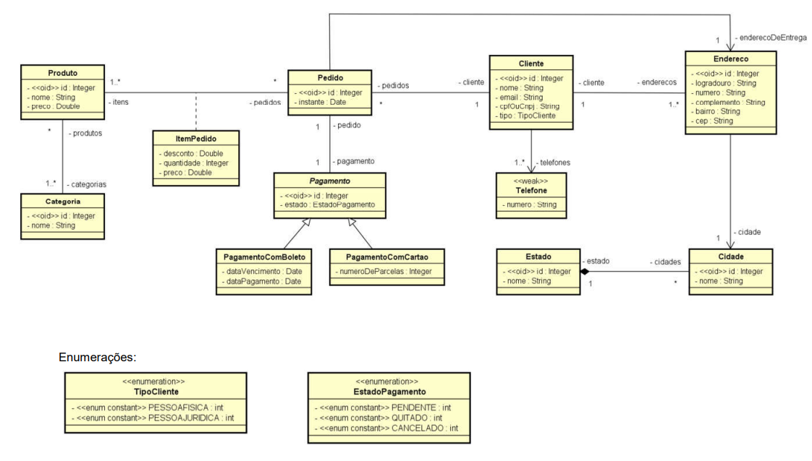

# 📌 Curso UML - Modelagem de Dados UML (Análise&Projeto Orientado a Objetos) 

Este repositório contém anotações e exemplos práticos baseados no curso **"[UML - Diagrama de Classes](https://www.udemy.com/course/uml-diagrama-de-classes/)"** disponível na Udemy.  

## 📖 Sobre o Curso  

O curso aborda os principais conceitos e práticas do **Diagrama de Classes da UML**, incluindo:  
- Fundamentos da UML  
- Classes, atributos e métodos  
- Relacionamentos (associação, agregação e composição)  
- Herança e polimorfismo  
- Diagramas de classes 

## 📂 Estrutura do Repositório  



```

```

## 🛠 Tecnologias e Ferramentas  
- UML (Unified Modeling Language)  
- Ferramenta de modelagem: **StarUML / Astah UML / Draw.io**  
- Linguagens utilizadas nos exemplos: **Java**,**H2**, Spring Boot 

## 📌 Objetivo
Criar os relacionamentos entre classes conforme a imagem do diagrama.
Utilizar JPA para mapear as entidades e seus relacionamentos.
Criar instâncias das classes no código para visualizar o funcionamento do modelo.
